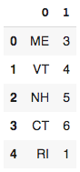

# Matplotlib with Pandas Dataframe Basics 

By Claire Morehouse

## Objectives

## Section 1: The basics of Pandas Dataframe 

Pandas dataframe is a package commonly used to deal with data analysis. Pandas is a high-level data manipulation tool developed by Wes McKinney. It is built on the Numpy package and its key data structure is called the DataFrame.The documentation for the pandas dataframe came be found [here](https://pandas.pydata.org/pandas-docs/stable/reference/api/pandas.DataFrame.html). Using pandas dataframe simplifies the loading of data from external sources such as text files and databases, as well as providing ways of analysing and manipulating data once it is loaded into your computer. The features provided in pandas automate and simplify a lot of the common tasks that would take many lines of code to write in the basic Python langauge. Pandas is best suited for structured, labelled data, in other words, tabular data, that has headings associated with each column of data. 

DataFrame is a 2-dimensional labeled data structure with columns of potentially different types. The DataFrame represents tabular data, soft of like a spreadsheet. DataFrames are organised into colums (each of which is a Series), and each column can store a single data-type, such as floating point numbers, strings, boolean values etc. DataFrames can be indexed by either their row or column names. DataFrames allow you to store and manipulate tabular data in rows of observations and columns of variables.


Sources for this section can be found [here](https://pandas.pydata.org/pandas-docs/stable/user_guide/dsintro.html#dsintro) and [here](https://www.learnpython.org/en/Pandas_Basics) and [here](https://realpython.com/pandas-dataframe/)

Let's try some basic coding with Pandas Dataframe. 

First, you need to import NumPy and load pandas.
```
import numpy as np
import pandas as pd
```

Next, we will create a dataframe object from a dictionary. To create a dataframe, use Python dictionary of lists, the dictionary keys will be used as column headers and the values in each list as columns. 

```
data = {'ME' : 3, 'VT' : 4, 'NH' : 5, 'CT' : 6, 'RI' : 1} 
df = pd.DataFrame(list(data.items())) 
df
```

We can accomplish the same output with the code below, where we create a DataFrame from Dictionary using default Constructor of pandas.Dataframe class

```
data = {'New England States': ['ME', 'VT', 'NH', 'MA', 'CT', 'RI'], 'Rank': [3, 4, 5, 2, 6, 1]}
pd.DataFrame.from_dict(data)
```

Either method, we've created a simple dataframe where column one is the abrievations for the six New England, and column two is my own personal rankings for each state (1 being the best, 6 the worst) (full disclosure: I'm from Connecticut). The variable data is a Python variable that refers to the dictionary that holds your candidate data. It also contains the labels of the columns:

Your output should look like this:



You may notice the output to the left is a column of numbers 1 - 6. This is the index. But what if you wanted to do a user-defined index with letters instead?

```
data = {'New England States': ['ME', 'VT', 'NH', 'MA', 'CT', 'RI'], 'Rank': [3, 4, 5, 2, 6, 1]} 
df = pd.DataFrame(data, index = ['a', 'b', 'c', 'd', 'e', 'f']) 
df 
```

Now that we have a dictionary, what types of things can we do with it?

What if you just want one specific column from the dataframe? You can do this wit the following code:

```
states = df['New England States']
states
```

## Section 2: The basics of matplotlib 

## Section 3: Application
