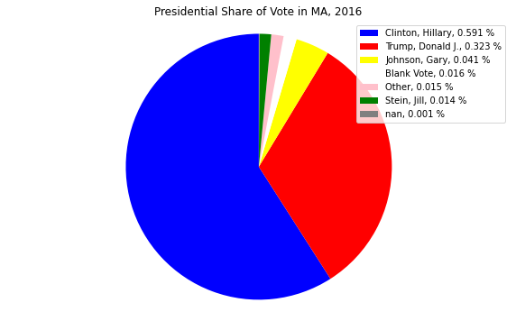

# Matplotlib with Pandas Dataframe Basics with Presidential Election Data

By Claire Morehouse

## Background and Objectives

Tools
Google Colab

## Section 1: The basics of Pandas Dataframe 

Pandas dataframe is a package commonly used to deal with data analysis. Pandas is a high-level data manipulation tool developed by Wes McKinney. It is built on the Numpy package and its key data structure is called the DataFrame.The documentation for the pandas dataframe came be found [here](https://pandas.pydata.org/pandas-docs/stable/reference/api/pandas.DataFrame.html). Using pandas dataframe simplifies the loading of data from external sources such as text files and databases, as well as providing ways of analysing and manipulating data once it is loaded into your computer. The features provided in pandas automate and simplify a lot of the common tasks that would take many lines of code to write in the basic Python langauge. Pandas is best suited for structured, labelled data, in other words, tabular data, that has headings associated with each column of data. 

DataFrame is a 2-dimensional labeled data structure with columns of potentially different types. The DataFrame represents tabular data, soft of like a spreadsheet. DataFrames are organised into colums (each of which is a Series), and each column can store a single data-type, such as floating point numbers, strings, boolean values etc. DataFrames can be indexed by either their row or column names. Each column of a Pandas DataFrame is an instance of pandas.Series, a structure that holds one-dimensional data and their labels.DataFrames allow you to store and manipulate tabular data in rows of observations and columns of variables.


Sources for this section can be found [here](https://pandas.pydata.org/pandas-docs/stable/user_guide/dsintro.html#dsintro) and [here](https://www.learnpython.org/en/Pandas_Basics) and [here](https://realpython.com/pandas-dataframe/)

Let's try some basic coding with Pandas Dataframe. 

First, you need to import NumPy and load pandas.
```
import numpy as np
import pandas as pd
```

Next, we will create a dataframe object from a dictionary. To create a dataframe, use Python dictionary of lists, the dictionary keys will be used as column headers and the values in each list as columns. 

```
data = {'ME' : 3, 'VT' : 4, 'NH' : 5, 'CT' : 6, 'RI' : 1} 
df = pd.DataFrame(list(data.items())) 
df
```

We can accomplish the same output with the code below, where we create a DataFrame from Dictionary using default Constructor of pandas.Dataframe class

```
data = {'New England States': ['ME', 'VT', 'NH', 'MA', 'CT', 'RI'], 'Rank': [3, 4, 5, 2, 6, 1]}
pd.DataFrame.from_dict(data)
```

Either method, we've created a simple dataframe where column one is the abrievations for the six New England, and column two is my own personal rankings for each state (1 being the best, 6 the worst) (full disclosure: I'm from Connecticut). The variable data is a Python variable that refers to the dictionary that holds your candidate data. It also contains the labels of the columns:

Your output should look like this:


You may notice the output to the left is a column of numbers 1 - 6. This is the index. But what if you wanted to do a user-defined index with letters instead?

```
data = {'New England States': ['ME', 'VT', 'NH', 'MA', 'CT', 'RI'], 'Rank': [3, 4, 5, 2, 6, 1]} 
df = pd.DataFrame(data, index = ['a', 'b', 'c', 'd', 'e', 'f']) 
df 
```

Now that we have a dictionary, what types of things can we do with it?

What if we want to sort the dataframe based on the ranking value? We can achieve this with the following code:

```
df.sort_values(by=['Rank'])
```
And you get the following output, with the states ranked by value.  


## Section 2: The basics of the python library matplotlib 

Matplotlib a comprehensive library for creating static, animated, and interactive visualizations in Python. This tutorial is for beginners, and thus we will only explore how to create static visualizations. 

In order to work with the library matplotlib, you first need to important the necessary packages/modules; numpy and matplotlib:

```
# Import the necessary packages and modules
import matplotlib.pyplot as plt
import numpy as np
import pandas as pd 
```

The next basic rule of thumb is to set up the data you are going to be using. In the application section, we will use data derived from a csv file and set up as a pandas dataframe. Here, however, we will create some simple data that we can create some sample plots with. 


## Section 3: Application

Now, let's take these basics and apply them in practice. This tutorial will use panda dataframes to create data visualization with the matplotlib python library. We will create four different plots: a bar chart, a pie chart, a box plot and a line plot. The code for each of plots is specific to the data used in this tutorial, but the techniques are applicable to creating visualizations from other data sources. 

### Data

For this tutorial, we are using U.S. President Data from 1976 - 2018 from MIT Election Data Science Lab found [here](https://electionlab.mit.edu/data) in csv format. When you open up the csv file in excel; the raw data looks like this:


As you can see, csv contains columns year, state, state-po (state's abbrievation), state_fips, state_cen, state_ic, office, candidate, party, writein, candidatevotes, total votes, version and notes. The documentation for these variables can be found [here](https://dataverse.harvard.edu/dataset.xhtml?persistentId=doi:10.7910/DVN/42MVDX). For this tutorial, we are particularly interested in the variables year, state, party, candidatevotes and totalvotes and the data visuals we can create with these variables. You can download the csv directly from this repository in the data folder. 

### Tutorial 

Let's first import the csv file with the data. After running this in colab, you will need to open up your file from your computer. 

```
from google.colab import files
uploaded = files.upload()
```

First, we need to create a pandas dataframe from the csv file. To do this, we use the following code to set the variable "df" for dataframe equal to the csv file reader. This dataset is very large, so we can use .head() to print the first few items and .tail() to print the last few items:

```
df = pd.read_csv("1976-2016-president.csv")
print(df.head(3))
print(df.tail(3))
```
First we will create a bar graph that compares the total votes Hillary Clinton, the democratic nominee received verses the total votes Donald Trump, the republican candidates, received in 2016.

```
# Create bar chart that shows 

# create dataframe that includes just the data for 2016
df_votes = df[(df["year"] == 2016)]

# use df.loc to create a pivot table for votes 
data = df_votes.loc[(df_votes['party'] == "democrat") | (df['party'] == "republican")]
table = pd.pivot_table(data=data,index='party',values='candidatevotes',aggfunc=np.sum)
table
```
Now, we'll create a bar chart with matplotlib.

```
# Create bar chart that shows 

# create dataframe that includes just the data for 2016
df_votes = df[(df["year"] == 2016)]

# use df.loc to create a pivot table for votes 
data = df_votes.loc[(df_votes['party'] == "democrat") | (df['party'] == "republican")]
table = pd.pivot_table(data=data,index='party',values='candidatevotes',aggfunc=np.sum)

# create plot size
fig, ax = plt.subplots(figsize=(10, 6))

# plot bar from the pivot table, add colors
plt.bar(table.index, table['candidatevotes'], color=['blue', 'red'])

#x-axis labels 
plt.xlabel('Party', fontsize = 12) 

#y-axis labels 
plt.ylabel('Number of Votes', fontsize = 12) 

#plot title 
plt.title('Total Votes 2016 Presidential Election', fontsize = 15) 

# derived from https://flynn.gg/blog/better-matplotlib-charts/
# Format numbers on y axis to show in millions

from matplotlib.ticker import FuncFormatter

def number_formatter(number, pos=None):
    """Convert a number into a human readable format."""
    magnitude = 0
    while abs(number) >= 1000:
        magnitude += 1
        number /= 1000.0
    return '%.1f%s' % (number, ['', 'K', 'M', 'B', 'T', 'Q'][magnitude])

ax.yaxis.set_major_formatter(FuncFormatter(number_formatter))

# plot show

plt.show()
```

Next we will create is a pie chart. 

```
# Create pie chart that shows for a particular state in a particular year, shows share of vote totals
import matplotlib.pyplot as plt

# Let's choose Massachusetts
df_pie_chart = df[(df["year"] == 2016) & (df["state"] == "Massachusetts")]
# Create voteshare column
df_pie_chart['Voteshare'] = df_pie_chart['candidatevotes'] / df_pie_chart['totalvotes']


labels = df_pie_chart['candidate'] #create candidate labels
sizes = df_pie_chart['Voteshare'] #create vote size label
colors = ['blue', 'red', 'yellow', 'white', 'pink', 'green', 'grey'] #create colors
fig1, ax1 = plt.subplots(figsize=(10, 6)) # create plot size
ax1.pie(sizes, startangle=90, colors = colors) # plot voteshare data, at 90 orientation, colors
ax1.axis('equal') # center 
plt.title("Presidential Share of Vote in MA, 2016") # title

# for each item, percent s in python is a way to insert a variable and insert a string, %s insert the name, calculates percentage, %% actually shows percent symbol. 
# for l, s in zip. l is refering to each label and s is referring to each size 

# create legend, use for loop to do this. %s in python is a way to inserts string, #1.3f formats percentage. l is label, s is size. Zip combines together. 
# So for for each item, creates legend formatted

plt.legend(labels=['%s, %1.3f %%' % (l, s) for l, s in zip(labels, sizes)]) 

# show plot
plt.show()
```

Next, let's create a boxplot
```
# Create box plot to compare the democrat verses republic state voter share values in 2016 
df_line_dem = df[(df["year"] == 2016) & (df["party"] == "democrat")]
df_line_dem['Voteshare'] = df_line_dem['candidatevotes'] / df_line_dem['totalvotes']
df_line_rep = df[(df["year"] == 2016) & (df["party"] == "republican")]
df_line_rep['Voteshare'] = df_line_rep['candidatevotes'] / df_line_rep['totalvotes']

#define data
# Create box plot to compare the democrat verses republic state voter share values in 2016 
df_bplot_dem = df[(df["year"] == 2016) & (df["party"] == "democrat")]
df_bplot_dem['Voteshare'] = df_bplot_dem['candidatevotes'] / df_bplot_dem['totalvotes']
df_bplot_rep = df[(df["year"] == 2016) & (df["party"] == "republican")]
df_bplot_rep['Voteshare'] = df_bplot_rep['candidatevotes'] / df_bplot_rep['totalvotes']

#define data
x1 = df_bplot_dem['Voteshare']
x2 = df_bplot_rep['Voteshare']
data = [x1, x2]
# create figure size
fig, ax = plt.subplots(figsize=(10, 6))
# build a box plot
ax.boxplot(data)
# title and axis labels
ax.set_title('Box Plot of Vote Share, 2016, n = 51 (50 states + DC)', fontsize = 15)
ax.set_ylabel('Vote Share', fontsize = 12)
ax.set_xlabel('Party', fontsize = 12)
# add horizontal grid lines
ax.yaxis.grid(True)
labels = ('Democrat', 'Republican')
plt.xticks(np.arange(len(labels))+1,labels)
# show the plot
plt.show()
```


Finally, we will create a line chart that shows from 1976 - 2016, the vote share of Republicans and Democrats in the state of Massachusetts.
```
# Create line plot of total votes from 1976 - 2016
# create dataframes
df_line_dem = df[(df["state"] == 'Massachusetts') & (df["party"] == "democrat")]
df_line_dem['Voteshare'] = df_line_dem['candidatevotes'] / df_line_dem['totalvotes']
df_line_rep = df[(df["state"] == 'Massachusetts') & (df["party"] == "republican")]
df_line_rep['Voteshare'] = df_line_rep['candidatevotes'] / df_line_rep['totalvotes']

# define plot size
fig, ax = plt.subplots(figsize=(10, 6))
# create x and y for dem line
x1 = df_line_dem['year']
y1 = df_line_dem['Voteshare']
# create x and y for rep line
x2 = df_line_rep['year']
y2 = df_line_rep['Voteshare']
#plot each line
plt.plot(x1, y1, label = "Democrat", color = "blue")
plt.plot(x2, y2, label = "Republican", color = "red")
# x axis label
plt.xlabel('Year')
# y axis labl
plt.ylabel('Percentage of Vote (%)')
# title
plt.title('Proportion of Presidential Vote, 1976 - 2016')
# show a legend on the plot
plt.legend()
# Display a figure.
plt.show()
```


