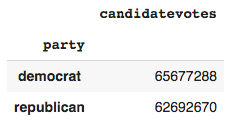

# The Basics of using Pandas Dataframe to create Static Visualizations with Matplotlib

_Created by Claire Morehouse_

Have questions about this tutorial? **Email me at: cmorehouse@clarku.edu**

## Background and Objectives

Thank you for visiting my tutorial! This tutorial is designed for a beginner's level coder who is looking to learn about how they can create data visualizations from csv data. 

Specifically, this tutorial aims to achieve three things:
**(1)** Give a basic understanding of Pandas Dataframes 
**(2)** Give a basic understanding of the matplotlib python library 
**(3)** Give a basic understanding of how dataframes can be used to create data visualizations with matplotlib

A lot of the tutorials that currently exist in this department do not operate from a a beginner's level of python, and that is what I hope to achieve with this tutorial. In addition, I hope you find the election data visualizations created with this code interesting, and the skills applicable to your own projects!

_Tech used for this tutorial: Google Colab, matplotlib python library, numpy python library, pandas package_ 

Code for this tutorial can be found in the code folder. Happy Coding! 

## Section 1: The basics of Pandas Dataframe 

Pandas dataframe is a package commonly used to deal with data analysis. Pandas is a high-level data manipulation tool developed by Wes McKinney. It is built on the Numpy package and its key data structure is called the DataFrame.The documentation for the pandas dataframe came be found [here](https://pandas.pydata.org/pandas-docs/stable/reference/api/pandas.DataFrame.html). Using pandas dataframe simplifies the loading of data from external sources such as text files and databases, as well as providing ways of analysing and manipulating data once it is loaded into your computer. The features provided in pandas automate and simplify a lot of the common tasks that would take many lines of code to write in the basic Python langauge. Pandas is best suited for structured, labelled data, in other words, tabular data, that has headings associated with each column of data. 

DataFrame is a 2-dimensional labeled data structure with columns of potentially different types. The DataFrame represents tabular data, soft of like a spreadsheet. DataFrames are organised into colums (each of which is a Series), and each column can store a single data-type, such as floating point numbers, strings, boolean values etc. DataFrames can be indexed by either their row or column names. Each column of a Pandas DataFrame is an instance of pandas.Series, a structure that holds one-dimensional data and their labels.DataFrames allow you to store and manipulate tabular data in rows of observations and columns of variables.


Sources for this section can be found [here](https://pandas.pydata.org/pandas-docs/stable/user_guide/dsintro.html#dsintro) and [here](https://www.learnpython.org/en/Pandas_Basics) and [here](https://realpython.com/pandas-dataframe/).

Let's try some basic coding with Pandas Dataframe. 

First, you need to the relevant packages. Import NumPy and load pandas with this code: 

```
import numpy as np
import pandas as pd
```

Next, we will create a dataframe object from a dictionary. To create a dataframe, use Python dictionary of lists, the dictionary keys will be used as column headers and the values in each list as columns. 

```
data = {'New England States': ['ME', 'VT', 'NH', 'MA', 'CT', 'RI'], 'Rank': [3, 4, 5, 2, 6, 1]} 
df = pd.DataFrame(data)
df 
```

Here, we've created a simple dataframe where column one is the abrievations for the six New England, and column two is my own personal rankings for each state (1 being the best, 6 the worst) (full disclosure: I'm from Connecticut). The variable data is a Python variable that refers to the dictionary that holds your rank data. It also contains the labels of the columns. 

Your output should look like this:


You may notice the output to the left is a column of numbers 1 - 6. This is the index. But what if you wanted to do a user-defined index with letters instead?

```
data = {'New England States': ['ME', 'VT', 'NH', 'MA', 'CT', 'RI'], 'Rank': [3, 4, 5, 2, 6, 1]} 
df = pd.DataFrame(data, index = ['a', 'b', 'c', 'd', 'e', 'f']) 
df 
```
Your output now looks like this: 


Notice the difference? Now that we have a dictionary, what types of things can we do with it?

What if we want to sort the dataframe based on the ranking value? We can achieve this with the following code:

```
df.sort_values(by=['Rank'])
```
And you get the following output, with the states ranked by value.  


This is a simple example of the many ways once you have a dataframe you can play with it. In the application section, we will delve deeper into dataframes and how you can manipulate them to create data visualizations. 

## Section 2: The basics of the python library matplotlib 

Matplotlib a comprehensive library for creating static, animated, and interactive visualizations in Python. This tutorial is for beginners, and thus we will only explore how to create static visualizations. 

For basic application, I like to break down the process into five parts to using matplotlib when you are trying to create a static data visualization. First, you need to establish or data munge. Second, you need to define your variables. Third, you need to plot those variables. Fourth, you do "all the extra stuff"; like labeling and gridlines. Finaly, you display your plot. Sound easy enough? Let's try it.

_Step 1. Import Packages and Create data/Data Munge_

First, let's import the necessary packages to work with matplotlib. For this exercise, we really only need to import matplotlib, but let's also import numpy and pandas for practice. 
```
# Import the necessary packages and modules
import matplotlib.pyplot as plt
import numpy as np
import pandas as pd 
```

In the application section, we will learn how to take data from a spreadsheet in csv format, and by using dataframes establish variables that are plotted with matplotlib. In this section, however, let's create our own data for simplicity. Since we're creating it ourselves, there's no cleaning necessary. Let's create a perfectly linear line graph. 

```
# Create Data
Year = [1998, 1999, 2000, 2001, 2002, 2003, 2004, 2005, 2006, 2007, 2008]
Age = [0, 1, 2, 3, 4, 5, 6, 7, 8, 9, 10]
```

_Step 2. Define Variables and figure and axes._

Since we defined our variables in the first section, this is not necessary. In the application section, when we are working with dataframes, we're going to want to define our variables equal to portions of the dataframe. We do however want to write the following code to define the plot size before we plot our data. 

```
fig, ax = plt.subplots(figsize=(10, 6)) # this creates the plot size
```

_Step 3. Let's plot!!_

Inside the parantheses, insert your x variable first, comma, and then your y variable. On thing to note is that in the parantheses you also can edit the output of the data. So, if you want the line to be red, you add a comma after the variables with color = "red". 

```
plt.plot(Year, Age, color = "red")
```

_Step 4. All the extra stuff_

Now comes the fun part. Warning: It can also be the most challening if the type of changes your are trying to implement into your visualization are not basic. However, for this application, let's still with some basic labeling, color changes, adding gridlines, and shifting font sizes, and creating the plot size. 

```
plt.title('Age by Year', fontsize=14) # create title, and add a comma with your fontsize
plt.xlabel('Year', fontsize=14) #label your axes
plt.ylabel('Age', fontsize=14)
plt.grid(True) # add a grid
```

_Step 4. Display your creation!_

This is done with the function plt.show()

```
plt.show()
```

Your output should look something like this:


While we created a line graph in this section, these principles will be applied to each visual we create in the application section. Now that we have the basics, let's move on and see what we can create with some real data! 

## Section 3: Application

Now, let's take these basics and apply them in practice. This tutorial will use panda dataframes to create data visualization with the matplotlib python library. We will create four different plots: a bar chart, a pie chart, a box plot and a line plot. The code for each of plots is specific to the data used in this tutorial, but the techniques are applicable to creating visualizations from other data sources. 

### Data

For this tutorial, we are using U.S. President Data from 1976 - 2016 from MIT Election Data Science Lab found [here](https://electionlab.mit.edu/data) in csv format. When you open up the csv file in excel; the raw data looks like this:


As you can see, csv contains columns year, state, state-po (state's abbrievation), state_fips, state_cen, state_ic, office, candidate, party, writein, candidatevotes, total votes, version and notes. The documentation for these variables can be found [here](https://dataverse.harvard.edu/dataset.xhtml?persistentId=doi:10.7910/DVN/42MVDX). For this tutorial, we are particularly interested in the variables year, state, party, candidatevotes and totalvotes and the data visuals we can create with these variables. You can download the csv directly from this repository in the data folder. 

### Tutorial 

Let's first import the csv file with the data. Remember, we are using Google Colab for this tutorial. After running this in colab, you will need to open up your file from your computer. 

```
from google.colab import files
uploaded = files.upload()
```

First, we need to create our default pandas dataframe from the csv file. We're going to use this dataframe to build all of our narrowed down versions for our future visualizations. To do this, we use the following code to set the variable "df" for dataframe equal to the csv file reader. This dataset is very large, so we can use .head() to print the first few items and .tail() to print the last few items:

```
df = pd.read_csv("1976-2016-president.csv")
print(df.head(3))
print(df.tail(3))
```
Your output should look like this:


Now we're ready to dive into our visualizations! And what better way to start than with a BAR CHART! This bar chart will compare the total votes Hillary Clinton, the democratic nominee received verses the total votes Donald Trump, the republican candidates, received in 2016. Our first stem is to create a new dataframe from our default dataframe that we created above that only contains rows that in the column "year" the cell contains 2016. So, we are using a conditional. 

Now comes the fun part: indexing and slicing data. Documentation on this can be found [here](https://pandas.pydata.org/pandas-docs/stable/reference/api/pandas.DataFrame.loc.html). We will use parts of these techniques for each of our visualization creations. Another great article that delves further into the topic can be found [here](https://medium.com/dunder-data/selecting-subsets-of-data-in-pandas-39e811c81a0c).

After we created the new dataframe containing just the year 2016, we will use a handy property of dataframes .loc, which allows us to access a group of rows and columns by label or boolean array. Documentation can be found [here](https://pandas.pydata.org/pandas-docs/stable/reference/api/pandas.DataFrame.loc.html). In our application, we use the loc property to set the variable data equal to the df_votes dataframe that only contains the rows that the column "party" has "democrat" or "republican" string values. Notice we use "|", which in Python means OR. 

Now with this data variable, we can create a pivot table (think Excel!) that sums the total votes for each party. 

```
# Create bar chart that shows 

# create dataframe that includes just the data for 2016
df_votes = df[(df["year"] == 2016)]

# use df.loc to create a pivot table for votes 
data = df_votes.loc[(df_votes['party'] == "democrat") | (df['party'] == "republican")]
table = pd.pivot_table(data=data,index='party',values='candidatevotes',aggfunc=np.sum)
table
```
Your output should look like this:



You may notice Hillary Clinton got almost three million more votes... damn that Electoral College! Now, we'll create a bar chart with matplotlib. We follow the same basic format as in the basics section, just with slightly different formating because we are working with dataframes. The most complicated part of this section is the formating of the y axis, using matplotlib.ticker, to make it so that the values are displayed in the millions. Documentation for matplotlib.ticker can be found [here](https://matplotlib.org/api/ticker_api.html). That particular line of code was taken from Christopher Flynn's blog, link found [here](https://flynn.gg/blog/better-matplotlib-charts/). Note from this code that when using matplotlib, you will run into formating roadblocks all the time depending on the niche output your are trying to accomplish. Luckily, the internet can often give you exactly the answers you are looking for, like in this example. 

```

# create plot size
fig, ax = plt.subplots(figsize=(10, 6))

# plot bar from the pivot table, add colors
plt.bar(table.index, table['candidatevotes'], color=['blue', 'red'])

#x-axis labels 
plt.xlabel('Party', fontsize = 12) 

#y-axis labels 
plt.ylabel('Number of Votes', fontsize = 12) 

#plot title 
plt.title('Total Votes 2016 Presidential Election', fontsize = 15) 

# derived from https://flynn.gg/blog/better-matplotlib-charts/
# Format numbers on y axis to show in millions

from matplotlib.ticker import FuncFormatter

def number_formatter(number, pos=None):
    """Convert a number into a human readable format."""
    magnitude = 0
    while abs(number) >= 1000:
        magnitude += 1
        number /= 1000.0
    return '%.1f%s' % (number, ['', 'K', 'M', 'B', 'T', 'Q'][magnitude])

ax.yaxis.set_major_formatter(FuncFormatter(number_formatter))

# plot show

plt.show()
```
The output for this code is here:


Next we will create is a pie chart with matplotlib. Using the same data, we want to create a pie chart that shows us for a particular state, I have chosen Massachusetts, what proportion of the vote did each candidate on the ballot get in 2016. We follow the same process as the bar chart where we using pandas dataframe techniques to slice a particular portion of the data. Here, we create the new dataframe df_pie_chart for just the subset of data that is from the year 2016, and from the state Massachusetts. Take note of the "&" AND syntax being used. We then create a new column in the dataframe, Voteshare, equal to candidate votes divided by the total votes, to give us the vote percentage that that particular candidate received out of the total votes in MA for the presidency in 2016. 

After that, follow our same basic matplotlib steps where we create out plot size, define some variables that we will embed into our pie plot. One of the trickiest parts of "the extra stuff" step for this portion is that we need to use a for loop to create the legend. Essentially how this works is that the label, which is equal to the candidate name, seen as "l" in this code, and sizes, or the votershare, seen as "s" in this code, are formatted in the first portion of the code, and then for each item essentially pulled into the legend. This code was derived from Stackoverflow. *find post*

```
# Create pie chart that shows for a particular state in a particular year, shows share of vote totals
# Let's choose Massachusetts
df_pie_chart = df[(df["year"] == 2016) & (df["state"] == "Massachusetts")]
# Create voteshare column
df_pie_chart['Voteshare'] = df_pie_chart['candidatevotes'] / df_pie_chart['totalvotes']

fig1, ax1 = plt.subplots(figsize=(10, 6)) # create plot size
labels = df_pie_chart['candidate'] #create candidate labels
sizes = df_pie_chart['Voteshare'] #create vote size label
colors = ['blue', 'red', 'yellow', 'white', 'pink', 'green', 'grey'] #create colors
ax1.pie(sizes, startangle=90, colors = colors) # plot voteshare data, at 90 orientation, colors
ax1.axis('equal') # center 
plt.title("Presidential Share of Vote in MA, 2016") # title

# for each item, percent s in python is a way to insert a variable and insert a string, %s insert the name, calculates percentage, %% actually shows percent symbol. 
# for l, s in zip. l is refering to each label and s is referring to each size 

# create legend, use for loop to do this. %s in python is a way to inserts string, #1.3f formats percentage. l is label, s is size. Zip combines together. 
# So for for each item, creates legend formatted

plt.legend(labels=['%s, %1.3f %%' % (l, s) for l, s in zip(labels, sizes)]) 

# show plot
plt.show()
```
Your output should look like this:


Next, let's create a box plot. Matplotlib is great for generating statistical visualizations. Box plots are created from descriptive statistics from a dataset. For our box plot, we want to be able to visualize the descriptive statistics for the vote shares in all fifty states + Washington, D.C. of Hillary Clinton and Donald Trump in 2016. The line in a box plot is the median, and the box forms the interquartile range, or the 25th and 75th percentile. Outliers are shown as dots.

To do this, we start by creating a new box plot dataframes for both democrat and republican data in 2016. These will form each of our boxes. We also need to create again a Voteshare variable. Hopefully by now, you're starting to get the basic feel for how to slice a subset of a dataframe to create a new dataframe that then can be used to build a matplotlib visualization. 

After create the new dataframes, we set these dataframes equal to two variables, x1 and x1. These are then set equal to a data variable. We can then use that data variable to plot the boxplot! In the "extra stuff" section, we add grid lines in order to better visualize the plots. You also may notice some tricky formating under labels. We use the plt.xticks() function to assign labels to both box plots on the x axis. Now let's plot!

```
# Create box plot to compare the democrat verses republic state voter share values in 2016 
# create dataframes
df_bplot_dem = df[(df["year"] == 2016) & (df["party"] == "democrat")]
df_bplot_dem['Voteshare'] = df_bplot_dem['candidatevotes'] / df_bplot_dem['totalvotes']
df_bplot_rep = df[(df["year"] == 2016) & (df["party"] == "republican")]
df_bplot_rep['Voteshare'] = df_bplot_rep['candidatevotes'] / df_bplot_rep['totalvotes']

#define data
# create figure size
fig, ax = plt.subplots(figsize=(10, 6))
x1 = df_bplot_dem['Voteshare']
x2 = df_bplot_rep['Voteshare']
data = [x1, x2]
# build a box plot
ax.boxplot(data)
# title and axis labels
ax.set_title('Box Plot of Vote Share, 2016, n = 51 (50 states + DC)', fontsize = 15)
ax.set_ylabel('Vote Share', fontsize = 12)
ax.set_xlabel('Party', fontsize = 12)
# add horizontal grid lines
ax.yaxis.grid(True)
labels = ('Democrat', 'Republican')
plt.xticks(np.arange(len(labels))+1,labels)
# show the plot
plt.show()
```
Your output should look like this. Let's see what we can learn from these visualizations. Now with this graph you can start to see the story of the 2016 elections take form, compared to the bar graph which showed Hillary Clinton with more votes. Here, you can see the Donald Trump's median value, the orange line, is higher than Hillary's. This is because in more states, he got a higher voter share. But -- let's not forget; most of our population is concentrated on coasts. So, Donald Trump gained a higher percentage of votes in rural states, which added to his electoral college win, even though he did not win the popular vote. 


Finally, we will create a line chart that shows from 1976 - 2016, the vote share of Republicans and Democrats in the state of Massachusetts. I hope by now you feel like you've got the hang of this. Again, we create a new dataframes from the original dataframe with a subset of the votes. For this visualization, we want subsets of the state of Massachusetts, and the party. We create again the variable Voteshare. 

Then, like always, we set our plot size. This we set our variables equal to a particular column of data. Then we plot, while also labeling and coloring the data. 
```
# Create line plot of total votes from 1976 - 2016
# create dataframes
df_line_dem = df[(df["state"] == 'Massachusetts') & (df["party"] == "democrat")]
df_line_dem['Voteshare'] = df_line_dem['candidatevotes'] / df_line_dem['totalvotes']
df_line_rep = df[(df["state"] == 'Massachusetts') & (df["party"] == "republican")]
df_line_rep['Voteshare'] = df_line_rep['candidatevotes'] / df_line_rep['totalvotes']

# define plot size
fig, ax = plt.subplots(figsize=(10, 6))
# create x and y for dem line
x1 = df_line_dem['year']
y1 = df_line_dem['Voteshare']
# create x and y for rep line
x2 = df_line_rep['year']
y2 = df_line_rep['Voteshare']
#plot each line
plt.plot(x1, y1, label = "Democrat", color = "blue")
plt.plot(x2, y2, label = "Republican", color = "red")
# x axis label
plt.xlabel('Year')
# y axis labl
plt.ylabel('Percentage of Vote (%)')
# title
plt.title('Proportion of Presidential Vote, 1976 - 2016')
# show a legend on the plot
plt.legend()
# Display a figure.
plt.show()
```
And... Voila! A Line graph from 1976 - 2016. You can see where Reaganism made a dent in blue MA, and then the Clinton Administration cemented the state as blue. 


## Acknowledgements 

Thank you to my professor of my introductory coding class, Shadrock Roberts!
